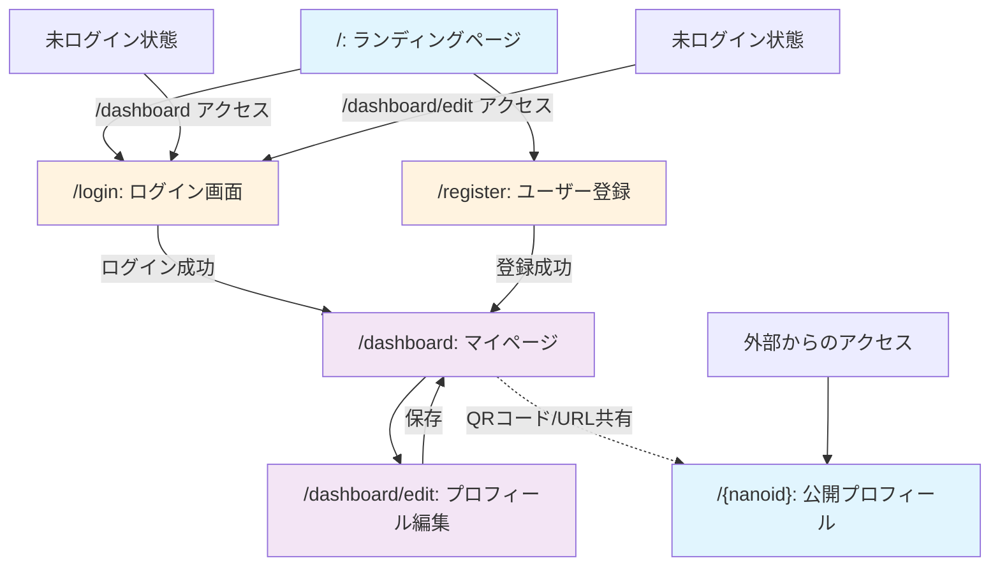

# Web名刺アプリケーション 要件定義書

## プロジェクト概要

### 目的
イベント等で名刺の代わりにURLを共有して自分のプロフィールを相手に伝えられる「web名刺」のアプリケーションを作成する。

### ターゲット
- 主なターゲット：ソフトウェアエンジニア
- 収益化は考えておらず、無料で提供

## 機能要件

### Must機能（MVP）

#### レイアウト
- **基本はスマホを対象とする**
- **PCで見ても違和感のない状態を目指す**

#### プロフィール入力（ログイン必須）
- **基本情報**
  - 名前
  - 職種
  - 所属会社
  - メールアドレス
- **関連リンク登録**
  - GitHub
  - Twitter
  - LinkedIn
  - Qiita
  - Zenn
  - その他URL

#### ユーザー登録・認証
- **Googleログイン + パスワード認証**
  - 基本はGoogleで、ユーザーがそれを拒否した場合にパスワードを使う
- **ユーザーの識別子はnano IDを利用**

#### プロフィール表示画面
- **登録したプロフィールを誰でも閲覧できる**

### Better機能（Phase 2）
- **プロフィールに画像を登録**
- **共有用QRコード生成・表示**
- **法的要件対応**
  - プライバシーポリシー
  - 利用規約

## 画面構成

### 画面一覧
| パス | 画面名 | 説明 | 認証要否 |
|------|--------|------|----------|
| `/` | ランディングページ | サービス説明、ユーザー登録・ログインへの遷移リンク | 不要 |
| `/login` | ログイン画面 | Googleログイン、パスワードログイン | 不要 |
| `/register` | ユーザー登録 | アカウント作成 | 不要 |
| `/dashboard` | マイページ | 自分のプロフィール、共有用QRコード、編集画面への遷移リンク | 必要 |
| `/dashboard/edit` | プロフィール編集 | プロフィール情報の入力・編集 | 必要 |
| `/{nanoid}` | 公開プロフィール | プロフィール公開ページ（誰でも閲覧可能） | 不要 |

#### Better機能で追加される画面
| パス | 画面名 | 説明 | 認証要否 |
|------|--------|------|----------|
| `/privacy` | プライバシーポリシー | 個人情報の取り扱いに関する方針 | 不要 |
| `/terms` | 利用規約 | サービス利用に関する規約 | 不要 |

### 画面遷移フロー

## 技術要件

### 認証・セキュリティ
- **Googleログイン優先、パスワード認証は補完**
- **未ログイン状態での認証必須画面アクセス時は `/login` にリダイレクト**

### データ設計
- **ユーザー識別子：nano ID**
- **公開URL：`/{nanoid}` 形式**

### レスポンシブ対応
- **スマートフォンファーストデザイン**
- **PC表示時も適切なレイアウト**

## 今後の検討事項

### 技術選定
- フロントエンド框架（Next.js、React + Express等）
- データベース（PostgreSQL、MongoDB、Firebase等）
- 認証システム（NextAuth.js、Firebase Auth等）
- ホスティング環境（Vercel、Netlify等）

### UX/UI詳細設計
- プロフィール編集フォームのUI
- 公開ページのレイアウト
- 関連リンクの表示方法

### データ構造設計
- ユーザーテーブル設計
- リンクデータの管理方法